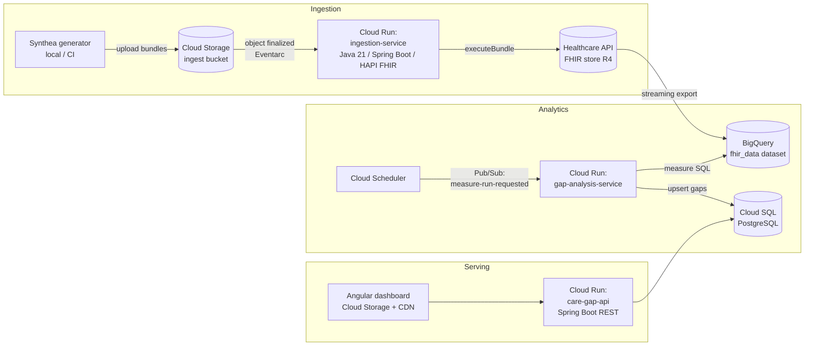

# FHIR Care Gap Analysis Pipeline — Architecture

**Status:** Proposed (Phase 1 — awaiting approval)
**Date:** 2026-07-04

---

## 1. System Overview

The pipeline separates the platform into two planes, which is the single most
important architectural decision in this design:

- **Clinical/operational plane** — the Google Cloud Healthcare API FHIR store is
  the system of record for clinical resources; Cloud SQL (PostgreSQL) is the
  operational store for care-gap records that the API and dashboard read and
  update.
- **Analytical plane** — BigQuery holds a flattened, queryable projection of the
  FHIR store where quality-measure logic runs as SQL.

This mirrors how real payer/provider analytics platforms are built: you never run
HEDIS-style population queries against a transactional FHIR server, and you never
serve low-latency dashboard reads from a data warehouse.

### End-to-end data flow

1. Synthea generates synthetic FHIR R4 transaction bundles; a script uploads them
   to the ingest bucket in Cloud Storage.
2. Each `object.finalized` event triggers the **ingestion-service** (Cloud Run)
   via Eventarc. The service downloads the bundle, parses/validates it with HAPI
   FHIR, and executes it against the Healthcare API FHIR store with retry +
   exponential backoff.
3. The FHIR store is configured with **streaming BigQuery export**: every
   created/updated resource is written to BigQuery within seconds, no batch jobs
   to orchestrate.
4. Cloud Scheduler publishes a `measure-run-requested` event to a Pub/Sub topic
   on a schedule (and the topic can also be published to manually for on-demand
   runs). The **gap-analysis-service** (Cloud Run, push subscription) runs the
   HEDIS-style measure SQL against BigQuery and upserts open/closed gap records
   into PostgreSQL.
5. The **care-gap-api** (Cloud Run) exposes REST endpoints over PostgreSQL; the
   Angular dashboard (static hosting on Cloud Storage behind Cloud CDN) consumes
   it.

---

## 2. Service Selection & Trade-offs

### 2.1 Cloud Run vs Cloud Functions

**Decision: Cloud Run for all three compute services.**

| Consideration | Cloud Run | Cloud Functions (2nd gen) |
|---|---|---|
| Java 21 + Spring Boot | First-class: any container | Supported, but framework startup inside the Functions runtime is awkward |
| Cold start | Tunable (min instances, CPU boost); container reuse | Same infra as Cloud Run 2nd gen, but less control |
| Request timeout | Up to 60 min | 60 min (2nd gen), but function model discourages long work |
| Local dev / testing | `docker run` or plain `mvn spring-boot:run` — identical to prod | Functions Framework shim; less faithful |
| One codebase pattern | Same Spring Boot skeleton for event handler *and* REST API | Would split the project across two programming models |

Cloud Functions 2nd gen is literally Cloud Run under the hood; choosing Functions
would only add a constraining abstraction on top of the same infrastructure. With
Spring Boot as the stated stack, Cloud Run lets every service share one
programming model, one Dockerfile pattern, and one local-dev workflow.
Scale-to-zero keeps idle cost at ~$0 for all three services.

**Cost:** Free tier covers ~180k vCPU-seconds/month; at portfolio traffic all
three services stay effectively free. **Ops trade-off:** you own the container
image (base image patching), which Functions would manage for you — acceptable,
and it's the realistic enterprise posture anyway.

### 2.2 Pub/Sub vs direct ingestion

**Decision: Eventarc (Pub/Sub-backed) for GCS → ingestion; one explicit Pub/Sub
topic (`measure-run-requested`) for triggering analysis. No hand-rolled Pub/Sub
plumbing for ingestion.**

The honest engineering answer is that this system does not need a hand-built
Pub/Sub pipeline for file ingestion. Eventarc *is* Pub/Sub under the hood (it
provisions the topic, subscription, retry policy, and dead-lettering for you) and
delivers GCS events to Cloud Run as CloudEvents. Building the same thing manually
would be boilerplate that demonstrates nothing except willingness to write it.

Where an explicit topic *does* earn its place is decoupling "something wants a
measure run" from "the analysis service": Cloud Scheduler, a manual `gcloud
pubsub topics publish`, or a future post-ingestion hook can all request a run
without knowing anything about the consumer. That's a genuine event-driven seam,
and it gives us retry/DLQ semantics on the most failure-prone job in the system.

**Rejected:** direct synchronous ingestion (client POSTs bundles straight to the
FHIR store) — loses the durable, replayable record of raw input files and the
automatic retry on transient failure; also rejected a topic-per-event-type fan-out
design as premature for one producer and one consumer.

**Cost:** Pub/Sub free tier is 10 GiB/month; our event volume is rounding error.

### 2.3 Cloud SQL (PostgreSQL) vs Firestore for care-gap records

**Decision: Cloud SQL PostgreSQL (smallest tier, e.g. `db-f1-micro`/
`db-custom-1-3840` depending on region availability).**

Care-gap records are *relational and operational*: a gap belongs to a patient and
a measure, has a lifecycle (`OPEN → CLOSED`), and the dashboard needs filtered,
paginated, aggregated queries ("open gaps by measure", "gap closure rate over
time", "gaps for patient X"). That is textbook relational workload:

- **Query shape:** Firestore requires composite indexes designed up-front per
  query and cannot do server-side joins or ad-hoc aggregation; SQL handles every
  dashboard query naturally.
- **Integrity:** upsert-with-uniqueness (`UNIQUE (patient_id, measure_id)`),
  foreign keys, and transactional close/reopen logic are native in PostgreSQL.
- **Ecosystem fit:** Spring Data JPA + Flyway migrations + Testcontainers is the
  standard enterprise Java stack — exactly what this portfolio should showcase.

**Cost — the honest caveat:** Cloud SQL is the one component that does *not*
scale to zero; the smallest instance runs ~$10–30/month. Firestore would be ~$0
at this scale. We accept that cost because it buys the realistic architecture
(and the instance can be stopped when not demoing). If cost were the top
priority, the fallback isn't Firestore — it's serving gap results directly from a
BigQuery results table and accepting warehouse latency on the API.

**Rejected:** Firestore (query limitations above), AlloyDB (overkill/cost),
Spanner (dramatically overkill).

### 2.4 BigQuery export strategy

**Decision: the FHIR store's built-in *streaming export* to BigQuery, analytics
schema (`SchemaType.ANALYTICS_V2`), with `WRITE_APPEND`-style versioned rows and
`_latest` views for current state.**

Options considered:

1. **Streaming export (chosen).** Configure `streamConfigs` on the FHIR store
   once; every resource create/update lands in BigQuery within seconds. Zero
   orchestration, zero export jobs to schedule or monitor, and it demonstrates
   the event-driven, near-real-time posture the project is about.
2. **Scheduled batch export** (`fhirStores.export` via Cloud Scheduler +
   workflow). More moving parts (a job to trigger, monitor, and handle overlap),
   data freshness bounded by the schedule, and it duplicates full snapshots.
   Right answer for very high write volume where streaming insert costs bite —
   not here.
3. **Custom pipeline** (ingestion service dual-writes to BigQuery, or Dataflow).
   Reimplements what the Healthcare API gives us for free, adds a consistency
   problem (two writers, two failure modes). Rejected outright.

One real nuance to design for: streaming export appends a row per resource
*version*. Measure SQL must select the latest version per resource — we'll ship
standard `*_latest` views (window over `meta.lastUpdated`) as part of the
BigQuery dataset setup, which is exactly what production teams do.

**Cost:** BigQuery on-demand pricing with the 1 TB/month free query tier;
Synthea-scale data (a few thousand patients) is megabytes, so effectively free.
Streaming insert cost at this volume is negligible.

### 2.5 HAPI FHIR vs native JSON processing

**Decision: HAPI FHIR as a *library* (structures + parser + validation) in the
ingestion service. Explicitly *not* the HAPI FHIR JPA server.**

Two separate questions hide in this comparison:

- **HAPI as the FHIR server?** No. The Google Cloud Healthcare API is our FHIR
  store: managed, versioned, HIPAA-eligible, with native BigQuery export.
  Self-hosting a HAPI JPA server would replace all of that with a database we
  have to operate, and would forfeit the streaming-export decision above.
- **HAPI as a parsing/model library vs raw Jackson/`JsonNode`?** HAPI. Typed
  `Bundle`, `Patient`, `Observation` models catch malformed resources at parse
  time, give us `FhirValidator` for pre-flight validation before we ship data to
  the store, and read as real healthcare engineering. Raw JSON tree-walking is
  faster to write for one field but becomes stringly-typed guesswork the moment
  measure logic needs `Observation.effectiveDateTime` vs `effectivePeriod`.

**Trade-off acknowledged:** HAPI's structures are heavyweight (~30 MB of jars,
slower parse than raw Jackson). At our volume that's irrelevant; correctness and
demonstrated FHIR fluency win. The gap-analysis service, notably, needs *no* FHIR
parsing at all — it reads flattened BigQuery columns — so HAPI stays contained in
the ingestion service.

---

## 3. Component Responsibilities

| Component | Runtime | Responsibility |
|---|---|---|
| `ingestion-service` | Cloud Run (Eventarc: GCS `object.finalized`) | Download bundle, HAPI parse + validate, `executeBundle` to FHIR store, retries w/ exponential backoff, structured logging |
| Healthcare API FHIR store | Managed | System of record for FHIR R4 resources; streaming export to BigQuery |
| BigQuery `fhir_data` | Managed | Analytics projection; `_latest` views; measure SQL runs here |
| `gap-analysis-service` | Cloud Run (Pub/Sub push: `measure-run-requested`) | Execute measure definitions as SQL, compute open/closed gaps, upsert to PostgreSQL, record run metadata |
| Cloud SQL PostgreSQL | Managed (smallest tier) | Operational store: `care_gap`, `measure`, `measure_run` tables; Flyway-managed schema |
| `care-gap-api` | Cloud Run (public HTTPS) | REST API: gaps by patient/measure/status, summary aggregates, measure catalog |
| Angular dashboard | Cloud Storage + Cloud CDN | Population summary, gap lists, drill-down per patient |
| Cloud Scheduler | Managed | Publishes nightly `measure-run-requested` |

### Initial measure set (simplified HEDIS-style)

Deliberately simplified denominators/numerators — documented as such, since real
HEDIS specs are licensed and vastly more intricate:

1. **CDC-A1c** — Diabetics (condition: SNOMED diabetes codes) with an HbA1c
   observation in the last 12 months.
2. **BCS** — Women 50–74 with a mammogram procedure/observation in the last 27
   months.
3. **COL** — Adults 45–75 with colorectal screening (colonoscopy in 10y or FIT in
   1y).

Each measure = one versioned SQL template + one row in the `measure` table.
Adding a measure is data + SQL, not code — a point worth making in the README.

---

## 4. Cross-cutting Concerns

- **Identity:** one service account per Cloud Run service, least privilege
  (`roles/healthcare.fhirResourceEditor` for ingestion only,
  `roles/bigquery.jobUser` + dataset read for analysis, `roles/cloudsql.client`
  where needed). Application Default Credentials everywhere; zero key files.
- **Networking:** Cloud SQL via the Cloud SQL Java connector (IAM auth);
  `care-gap-api` public with CORS restricted to the dashboard origin; internal
  services require authenticated invocation (Eventarc/Pub/Sub service agents).
- **Resilience:** ingestion retries transient FHIR-store failures (429/5xx) with
  exponential backoff + jitter; Eventarc redelivery + DLQ topic catch poison
  bundles; gap analysis is idempotent (deterministic upsert keyed on
  patient+measure), so Pub/Sub at-least-once delivery is safe.
- **Observability:** JSON structured logging (Logback + Google Cloud Logging
  encoder) with correlation fields (`bundleId`, `measureRunId`); Cloud Run
  metrics out of the box; error surfaces via Cloud Error Reporting.
- **Config:** all environment-specific values (project ID, FHIR store path,
  dataset names, DB coordinates) via environment variables into Spring
  `@ConfigurationProperties`.
- **PHI posture:** synthetic data only (Synthea), stated prominently; the
  architecture is nonetheless HIPAA-alignable because every managed service used
  is HIPAA-eligible under GCP's BAA.
- **Infrastructure as code:** Terraform for all GCP resources; deploy via
  `gcloud run deploy` from Cloud Build (or GitHub Actions with Workload Identity
  Federation).

### 4.1 Closed-loop gaps-in-care (added post-v1)

The gap-analysis service publishes every evaluated gap back to the FHIR store
as a `DetectedIssue` — a simplified version of the Da Vinci DEQM gaps-in-care
exchange pattern, making the clinical store the system of record for gaps as
well as source data. Deterministic resource ids (`caregap-<measure>-<patient>`)
keep the write idempotent under Pub/Sub redelivery, matching the pipeline's
end-to-end idempotency contract. Closure is modeled as a `mitigation` entry
(R4 `DetectedIssue.status` has no "resolved" concept); the issue's `code`
carries the measure in a project-local code system. Write-back is a feature
flag: off by default, on in the dev environment and in the local compose loop.

## 5. Cost Envelope (monthly, portfolio-scale)

| Item | Estimate |
|---|---|
| Cloud Run ×3, Pub/Sub, Eventarc, Scheduler, GCS, BigQuery | ~$0 (free tiers) |
| Healthcare API FHIR store | ~$1–5 (structured storage + requests at Synthea scale) |
| Cloud SQL (smallest tier, always-on) | ~$10–30 — **the dominant cost; stop the instance when not demoing** |
| **Total** | **~$15–35/month, <$5 with Cloud SQL stopped** |

## 6. Risks / Open Questions

1. **Synthea bundle size** — some patient bundles exceed a few MB with hundreds
   of entries; `executeBundle` handles this fine, but we'll cap and log entry
   counts, and can shard oversized bundles if needed.
2. **Streaming export lag** — seconds, not guaranteed-zero; nightly measure runs
   make this a non-issue, but ad-hoc runs immediately after ingestion could see
   slightly stale data. Documented behavior, not a bug.
3. **Angular hosting** — Cloud Storage + CDN chosen for GCP purity; Firebase
   Hosting is the ergonomically nicer alternative if we accept the Firebase
   toolchain. Flagged for Phase 2 decision.
   *(Resolved during milestone 5: the dashboard is served by **Cloud Run
   (nginx)** instead. A GCS static site requires an HTTPS load balancer at
   ~$18/month — it would have been the single largest cost in the project —
   while Cloud Run scales to zero with TLS included and keeps the whole
   stack on one runtime. Firebase Hosting was rejected to avoid a second
   toolchain.)*
