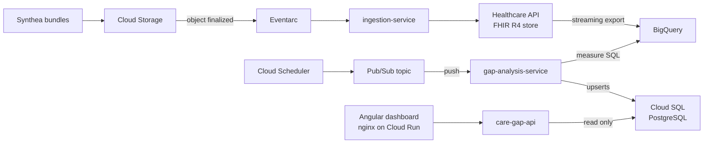

# Start Here: A Working Map of the Project

This is the implementation-oriented companion to
[ARCHITECTURE.md](ARCHITECTURE.md) and
[REPOSITORY_DESIGN.md](REPOSITORY_DESIGN.md). Those documents explain why the
system was designed this way; this guide explains what exists now, where it
lives, and how to read it.

## The project in one sentence

Synthetic FHIR data enters through an event-driven ingestion service, is stored
as clinical records and projected into BigQuery, is evaluated by SQL quality
measures, and becomes operational care-gap records served by an API and Angular
dashboard.

The central architectural boundary is between two kinds of work:

- The **clinical/analytical side** keeps FHIR resources in the Healthcare API
  and runs population queries in BigQuery.
- The **operational/serving side** keeps the much smaller set of computed care
  gaps in PostgreSQL for predictable API and dashboard reads.

BigQuery is not the application's database, and the FHIR store is not used for
population analytics. PostgreSQL is the handoff between analysis and serving.

## The whole data flow



All four application workloads are containers on Cloud Run. The two
event-driven Java services still receive ordinary HTTP requests: Eventarc and a
Pub/Sub push subscription are authenticated callers of their `POST /`
endpoints.

### One bundle ingestion

1. A `.json` object lands in the ingest bucket.
2. Eventarc sends its CloudEvent to `GcsEventController`.
3. `IngestionService` reads the object, parses it as a strict FHIR R4
   transaction bundle, and rewrites Synthea's creates as deterministic PUTs.
4. `HapiFhirStoreClient` executes the transaction against the FHIR endpoint.
5. Transient connection, rate-limit, and server errors receive short local
   retries. If they still fail, a `503` asks Eventarc to redeliver. Deterministic
   bad input is acknowledged and logged because retrying cannot repair it.
6. The Healthcare API streams each FHIR resource version to BigQuery.

The PUT rewrite is the key reliability detail. Event delivery is at least once,
so replay must overwrite the same resource IDs instead of creating duplicates.

### One measure run

1. Cloud Scheduler publishes to `measure-run-requested`; the same topic can be
   published manually for an ad hoc run or backfill.
2. Pub/Sub pushes an envelope to `MeasureRunController`. Its optional data is a
   base64-encoded `{"runDate":"YYYY-MM-DD"}` JSON object.
3. `GapAnalysisService` creates a `measure_run`, then evaluates each catalogued
   measure.
4. `BigQueryMeasureRunner` binds `@run_date`, substitutes the validated dataset
   name, and executes the SQL from `measures/`.
5. Each query returns the same small contract:
   `patient_id`, `in_numerator`, and `last_evidence_date`.
6. `CareGapWriter` batches PostgreSQL upserts keyed by
   `(measure_id, patient_id)`. A patient in the numerator is `CLOSED`; a patient
   outside it is `OPEN`.
7. The run is marked `SUCCEEDED` or `FAILED`. Returning a non-2xx response asks
   Pub/Sub to retry. The care-gap state is safe to replay because its upserts
   are deterministic; each attempted delivery still gets its own run-history
   row.

Each measure SQL file deduplicates the Healthcare API's versioned BigQuery rows
inside its own `*_latest` CTEs. There are no separately managed `_latest` views
in the current Terraform.

### One dashboard load

1. nginx serves the compiled Angular single-page application from Cloud Run.
2. Its container startup script writes `env.js` using the deployed `API_URL`.
   This lets one built image run in different environments.
3. `ApiService` calls the public, read-only API for measure metadata, summary
   counts, recent runs, and paginated gaps.
4. The API uses Spring Data JPA to query PostgreSQL and returns explicit DTOs.

## Repository map

| Path | What it owns | Best first file |
|---|---|---|
| `pom.xml` | Java version, dependency BOMs, plugin defaults, and the three-module Maven reactor | `pom.xml` |
| `services/ingestion-service` | GCS event to validated, replay-safe FHIR transaction | `event/GcsEventController.java` |
| `services/gap-analysis-service` | Measure orchestration, BigQuery execution, PostgreSQL writes, and database migrations | `gaps/GapAnalysisService.java` |
| `services/care-gap-api` | Read-only HTTP API over computed gaps | `gap/GapController.java` |
| `dashboard` | Angular standalone components and the nginx runtime image | `src/app/app.ts` |
| `measures` | Reviewable BigQuery SQL for the three simplified measures | `cdc-a1c.sql` |
| `infra/modules` | Reusable Terraform grouped by platform capability | `*/main.tf` |
| `infra/envs/dev` | Composition root for one deployed environment | `main.tf` |
| `.github/workflows` | CI plus path-filtered container deployments | `ci.yml` |
| `tools` | Synthea generation/upload and a local event-driving script | `local/ingest-local.sh` |
| `docs` | Architecture decisions, repository design, and newcomer guides | this file |

Java packages are organized by capability rather than technical layer. For
example, the API keeps the gap entity, repository, and controller together under
`api/gap`. This is closer to feature folders or vertical slices than a solution
with global `Controllers`, `Services`, and `Repositories` projects.

## The three Java services

### `ingestion-service`

Read it in this order:

1. `event/GcsEventController.java` — transport contract and ack/retry behavior.
2. `ingest/IngestionService.java` — the use-case orchestration.
3. `fhir/BundleParser.java` and `fhir/BundleTransformer.java` — domain boundary
   and idempotency.
4. `storage/BundleObjectReader.java` and `fhir/FhirStoreClient.java` — small
   ports with local/GCP implementations behind them.
5. `config/*` and `application*.yml` — environment-specific wiring.

HAPI FHIR is a client/model library here. The production FHIR server is Google's
Healthcare API. The HAPI server in Docker Compose is only a local stand-in that
implements the same FHIR R4 REST protocol.

### `gap-analysis-service`

Read it in this order:

1. `event/MeasureRunController.java` — Pub/Sub envelope and retry contract.
2. `gaps/GapAnalysisService.java` — the run-level use case.
3. `measure/MeasureCatalog.java` — the configured measure set.
4. `bigquery/BigQueryMeasureRunner.java` — the analytical adapter.
5. `gaps/CareGapWriter.java` and `gaps/MeasureRunTracker.java` — the operational
   database writes.
6. `resources/db/migration` — the schema this service owns.

This service uses plain `JdbcTemplate`, not JPA, because its dominant operation
is a fixed-shape batched PostgreSQL `INSERT ... ON CONFLICT`.

Adding a measure currently touches three intentional sources of truth:

1. Add its SQL file under `measures/`.
2. Add its ID, display name, and resource path to `MeasureCatalog`.
3. Seed the same ID and display name in a new Flyway migration.

The service POM packages the repo-level SQL files into the application jar.

### `care-gap-api`

Read it in this order:

1. `gap/GapController.java` — filtering, paging, response DTOs, and summary.
2. `gap/CareGapRepository.java` — JPQL query shapes.
3. `measure/MeasureController.java` and `run/RunController.java` — supporting
   reads.
4. The three JPA entities — mappings to the writer-owned schema.

The API deliberately does not migrate the database. Hibernate uses
`ddl-auto: validate`, so it fails startup when mappings drift from the schema
owned by `gap-analysis-service`.

## Configuration and environment switching

Spring configuration follows this precedence in practice:

```text
application.yml defaults
        + active profile file (application-local.yml)
        + environment variables
```

- Cloud Run sets `SPRING_PROFILES_ACTIVE=gcp` and injects resource coordinates
  such as `FHIR_STORE_URL`, `BQ_DATASET`, and `DB_JDBC_URL`.
- Local runs use `-Dspring-boot.run.profiles=local`.
- `@Profile("local")` selects filesystem/no-op adapters;
  `@Profile("!local")` selects GCS and BigQuery adapters.
- Production authentication uses Application Default Credentials and the Cloud
  Run service's identity. There are no service-account key files or database
  passwords in the deployed path.

## Local development: what is faithful and what is substituted

`docker compose up -d` starts two dependencies:

- HAPI FHIR on `localhost:8090`, standing in for the Healthcare API FHIR store.
- PostgreSQL on `localhost:5433`, standing in for Cloud SQL.

The local ingestion path is end to end: a synthetic Eventarc request reads a
bundle from disk and writes it to HAPI FHIR. See the root README for the exact
commands.

The local analysis path is intentionally partial. `LocalMeasureRunner` returns
an empty patient list because there is no credible BigQuery emulator. Running
the service locally still exercises its Pub/Sub-shaped endpoint, Flyway
migrations, run tracking, and PostgreSQL writer, but it does not calculate real
gaps from the locally ingested HAPI data. Consequently, a local dashboard will
not display meaningful gap results unless the database is populated by a test
fixture or other deliberate seed. Real SQL evaluation happens against GCP
BigQuery.

Also note that every Java service defaults to port `8080`. Run one at a time or
set a different `PORT` for each when exercising several together.

## Build, test, provision, deploy

There are two build systems because there are two ecosystems:

```text
mvn verify                   all Java unit + integration tests
mvn -pl services/care-gap-api -am verify
                              one Maven module plus required reactor projects

cd dashboard
npm ci
npm test -- --watch=false    Angular tests
npm run build                production SPA build

terraform fmt -check -recursive infra
terraform -chdir=infra/envs/dev validate
```

The root POM manages versions and builds three independent Spring Boot apps; it
does not produce a shared application or common library. Jib builds the Java
container images without Dockerfiles. The dashboard uses a multi-stage
Dockerfile because it builds with Node and serves with nginx.

Infrastructure and application rollout have separate ownership:

- Terraform creates APIs, identities, IAM grants, data services, eventing,
  Cloud Run service definitions, and Artifact Registry. Placeholder images let
  the first apply succeed.
- GitHub Actions builds images and deploys new Cloud Run revisions. Terraform
  ignores later image changes so a routine apply cannot roll an app backward.
- GitHub authenticates to GCP through OIDC Workload Identity Federation rather
  than a stored JSON key.

## Contracts worth keeping in your head

| Contract | Producer | Consumer |
|---|---|---|
| GCS CloudEvent body + `ce-type` header | Eventarc | `GcsEventController` |
| FHIR R4 transaction bundle | Synthea/ingestion | Healthcare API or local HAPI |
| Analytics V2 FHIR tables | Healthcare API stream export | measure SQL |
| Three-column measure result | SQL in `measures/` | `BigQueryMeasureRunner` |
| `measure`, `measure_run`, `care_gap` schema | gap analysis Flyway migrations | writer and read API |
| `/api/gaps`, `/api/gaps/summary`, `/api/measures`, `/api/runs` JSON | care-gap API | Angular `ApiService` |
| Terraform outputs/repository variables | provisioned dev environment | deploy workflows |

When changing one side of a row, find and verify the other side.

## A practical reading path

If you have an hour, use this order:

1. Read this guide and follow the end-to-end diagram once.
2. Trace `GcsEventController` to `IngestionService`, then read one ingestion
   unit test.
3. Read one measure SQL file before reading `GapAnalysisService`; the SQL is the
   business logic and Java is its orchestrator.
4. Trace `GapController` through its repository and then into `ApiService` in
   the dashboard.
5. Read `infra/envs/dev/main.tf`, then open only the module behind the resource
   you are curious about.
6. Read the CI workflow last; it will make more sense once the deployables are
   familiar.

For a first hands-on exercise, change no code: run the local ingestion loop,
inspect the FHIR Patient count, then replay one bundle and confirm the count does
not increase. That demonstrates FHIR transactions, the local adapter boundary,
and at-least-once idempotency in one small experiment.

## Which document wins?

Use the sources in this order when they disagree:

1. Executable code, Terraform, and workflows describe the current system.
2. This guide describes that implementation at a point in time.
3. `ARCHITECTURE.md` and `REPOSITORY_DESIGN.md` preserve design rationale and
   some proposal-era history.

One visible example is dashboard hosting: the original diagrams mention Cloud
Storage/CDN, while the implemented dashboard is an nginx container on Cloud Run.
The amendment is recorded later in `ARCHITECTURE.md`.
